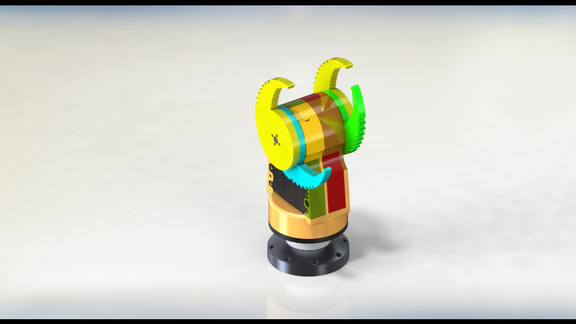

#+TITLE: fletcherporter.com
#+AUTHOR: Fletcher Porter

#+HUGO_BASE_DIR: ../

#+CITE_EXPORT: csl fp.csl

* Homepage
:PROPERTIES:
:EXPORT_TITLE: Fletcher Porter
:EXPORT_FILE_NAME: _index
:EXPORT_HUGO_SECTION: /
:END:

[[mailto:me@fletcherporter.com][me@fletcherporter.com]] · +358 41 476 3167

Here is a link to my resume: [[../tex/Fletcher_Porter.pdf][Current October 2023]]

* Blog
:PROPERTIES:
:EXPORT_HUGO_SECTION: blog
:END:

** DONE Gravity Offload System :mechanical:electrical:control:nasa:jpl:robosimian:
CLOSED: [2020-03-16]
:PROPERTIES:
:EXPORT_FILE_NAME: gravity-offload-system
:END:

In 2018 I did an internship at NASA Jet Propulsion Laboratory where I worked on a gravity-offload system to test mobility for a future rover mission to Saturn's moon Enceladus.

Prior to my arrival, there was already an offload system that consisted of a couple constant force springs hanging from a gantry on the ceiling of a shipping container. These springs connected to a robot that would drive on Enceladus-analogue dust. The gantry got pulled along the test chamber by the robot [[https://www.jpl.nasa.gov/robotics-at-jpl/robosimian][RoboSimian]], but this was problematic because friction in the gantry led to non-vertical forces on the robot, which isn't physical. My task was to add an active system to eliminate this friction.

#+CAPTION: The testbed was an inclined sandbox inside a shipping container with the gantry welded to the ceiling.
[[file:assets/ContainerTopLevel.png]]

To do that, I made a robot that attached to the gantry and pulled on a chain to propell the system along the chamber. The system had a camera on it that was used to detect the position of the robot and regulate the relative position of the offload system so the robot was always in the center of the frame.

#+CAPTION: The robot bolted on to two gantry carriages and pulled itself along with a chain and sprocket.
[[file:assets/FullAssy_Iso1_transBackgroundWithIBeam.png]]

Ultimately, the system was very successful. Almost all non-vertical forces were removed by the system, and the system has been able to date for a year and a half with only minimal maintenance according to the team.

#+CAPTION: On the right is the camera that detects RoboSimians position which is fed back into the controller.  Also visible are supporting electronic and the mechanical system in the back.
[[file:assets/GOS_bottomIso.jpg]]

** DONE Vine Robots                     :mechanical:pneumatic:softrobot:ucsb:
CLOSED: [2020-03-16]
:PROPERTIES:
:EXPORT_FILE_NAME: vine-robots
:END:

In 2019, I worked with the [[https://www.hawkeslab.com/][Hawkes Lab]] at UC Santa Barbara on developing a tool mount for their soft vine-like robots. I ultimately made two prototypes.

The first, seen below, is a set of three inflated plastic tubes bound together with magnets that can extend and retract. A tool attached to a plate on the end which mated to the pnuematic structure with a piece of sugical tubing that was gripped by pressure from the tubes.

#+CAPTION: With three tubes, it could orient the tool by everting the tubes relative to eachother.
[[file:assets/threeTube.jpg]]

The other was a clamp where one half was inside the tube and the other half was on the outside of the tube, and the two were bonded together with magnetic rollers that allowed the robot to evert and invert while the tube rode on the end.

#+CAPTION: A tool could be attached to the outer piece and could get data and power transmission to the inside of the tube through a contactless interfaces.
[[file:assets/clamp.png]]

** DONE Presenting at the 2019 FIRST Tech Challenge Kickoff Workshop :design:presentation:
CLOSED: [2019-09-13]
:PROPERTIES:
:EXPORT_FILE_NAME: ftc-kickoff-2019
:END:

I was asked by the Los Angeles FIRST Tech Challenge organization to give a workshop on engineering design to high school students at the annual kickoff for the new season of competitive high school robotics. I gave two sessions of a 45 minute presentation on how to create innovative components for their robots to an audience of a few dozen students in each session.

#+CAPTION: Students look on to my presentation as they learn about engineering design
[[file:assets/workshop_in_progress.png]]

[[file:assets/making_innovative_designs.pdf][These]] are the slides for the presentation I gave.  The topic was how to design innovative systems, especially for the robots that the students will be building for their competition.  I went over how to create a design specification given a design problem (an essential step for designing any system, innovative or not), defining what and innovation even is, identifying when it's useful or not to innovate, and throughout I showed off useful tools to try to understand design.

** DONE A dolly with assisted stair climbing     :mechanical:electrical:ucsb:
CLOSED: [2024-08-06]
:PROPERTIES:
:EXPORT_FILE_NAME: stair-climbing-dolly
:END:

My bachelor thesis was to design and build a dolly that could carry a heavy, sensitive payload up and down stair with minimal force necessary from the user.  The solution I and my group came up with was to build a motorized dolly.

#+CAPTION: The payload is the black package.  The system was built on top of an off-the-shelf dolly.
[[file:assets/dolly.jpg]]

The working principle was that a flipper would push against the stairs to either pull the dolly up or resist it going down.  The control was very simple, the user commanded forward, off, or backward.

#+CAPTION: The drivetrain was a motor that turned a perpendicular shaft.  The universal joint and bearings were to take radial loads off of the motor shaft.
#+NAME: fig:dolly_drivetrain
[[file:assets/dolly_drivetrain.jpg]]

#+CAPTION: The controller was just two buttons.  The underlying computation was done by a few logic gates.
[[file:assets/dolly_controller.jpg]]

The most fun part of this project was that I got to machine most of the parts my self on a manual mill and lathe.

#+CAPTION: One of the drawings for a part that I made.  You can see it in figure [[fig:dolly_drivetrain]] holding each of the wheels on.
[[file:assets/replacement_dolly_axel.png]]

** DONE Computational Olympic rings             :programming:mathematica:fun:
CLOSED: [2019-08-06]
:PROPERTIES:
:EXPORT_FILE_NAME: computational-olympic-rings
:END:

I've heard that the Olympic Rings logo's colors are based on the colors of the world's flags. With this project, I sought to find out if you would get a similar logo if you captured the colors of the world's flags and made the Olympic Rings logo with them.  I wrote [[file:assets/olympic_rings.pdf][this article]] to determine if that's true.  Turns out, it is!

#+CAPTION: The Olympic Rings according a color palette found by studying all the world's flags
[[file:assets/olympic_rings.png]]

** DONE Who should star in the next Shovel Knight game? :programming:mathematica:fun:
CLOSED: [2019-08-17]
:PROPERTIES:
:EXPORT_FILE_NAME: shovel-knight-poll
:END:

I did a poll in 2018 asking people what characters they'd like to see playable in a future installment of Shovel Knight. Rather than just counting the votes directly and finding a result, I created a method to find out what types of characters people would like and ultimately come up with a list of characters that the community wants that appeals to the most people while also giving the developers some freedom to pick what characters they want. You can read about it [[file:assets/SK_poll_analysis.pdf][here]].

#+CAPTION: A plot of which characters were frequently voted together.  Darker colors indicate greater frequency.
#+NAME: foo
[[file:assets/characterPairs.png]]

** DONE An Automatic Security Camera Lens Cleaner :mechanical:electrical:pneumatic:lunduniversity:
CLOSED: [2018-10-30]
:PROPERTIES:
:EXPORT_FILE_NAME: security-camera-window
:END:

During an exchange at Lund University in Sweden, I had a course project to develop a system for Axis Communications AB to clean the windows on their security cameras when rainwater or dirt gets on them. The system did this by compressing air onboard and spraying that air onto the camera window.

#+CAPTION: The system had a compressor from an electric bicycle tire pump (left), a control valve (center) to activate the quick-emission valve (right) to push a burst of air through a hose onto the camera's lens.
[[file:assets/security_camera_lens_cleaner.jpg]]

I did the mechanical design of the system, sizing and selecting the compressor, valves, and connectors in the system. I also participated in the initial ideation of the system, contributing many of the ideas that ultimately were included in the final system, as well as collecting all the ideas into a system schematic.  You can see a demonstration of its operation here.

[[yt:nzDOJuoSqGU]]

** DONE Boring 20km into Europa's surface           :mechanical:ice:nasa:jpl:
CLOSED: [2016-08-26 Wed 16:29]
:PROPERTIES:
:EXPORT_FILE_NAME: owms
:END:
During an internship at NASA Jet Propulsion Laboratory in 2016, I designed a system to test a concept for a probe to explore inside of Jupiter's moon Europa. It uses a circular saw rotating about the vertical axis to create a borehole in ice, which on Europa would be ~20 km deep. I was an author of a paper on this system published in IEEE aerospace, available [[https://ieeexplore.ieee.org/document/7943863][here]].

#+CAPTION: This component is a level wind for the system.  It held a tether (green, 20 km worth) and spooled it out one layer at a time, each layer alternating spiraling inward and outward.  The mechanical components rotated about the threaded central pillar and the tether would go up along the red pulley as it traveled along the length of the cyan shaft.
[[file:owms_level_wind.PNG]]

This video shows the probe as it would be applied on Europa.

[[yt:nBzBeYsdNsM?start=62][Exploring Ocean Worlds with NASA Robots]]

This video shows a test I designed for verifying that the circular saw concept for creating the borehores works (it does!).

[[yt:dgGWmtRm8hI][OWMS Saw Test]]

** DONE OPALS Wikipedia Article                      :writing:ucsb:wikipedia:
CLOSED: [2015-11-28 Sat 16:28]
:PROPERTIES:
:EXPORT_FILE_NAME: opals-wikipedia
:END:

During fall quarter of my freshman year at UCSB, I wrote a Wikipedia article for a writing class on the [[https://www.jpl.nasa.gov/missions/optical-payload-for-lasercomm-science-opals][Optical PAyload for Lasercomm Science (OPALS)]] mission out of JPL/Caltech.

You can view it [[https://en.wikipedia.org/wiki/OPALS][here]].

#+CAPTION: OPALS under construction (/Image credit JPL/Caltech via Wikimedia Commons/)
[[file:assets/opals_under_construction.jpg]]

** DONE A hand for a disaster recovery robot :mechanical:robosimian:nasa:jpl:
CLOSED: [2024-10-21]
:PROPERTIES:
:EXPORT_FILE_NAME: hand-disaster-recovery-robot
:END:

In summer 2014, I worked at NASA Jet Propulsion Laboratory in their Robotic Vehicles and Manipulators lab. I worked on the design for a so-called Cam Hand for the disaster recovery robot, [[https://www.jpl.nasa.gov/robotics-at-jpl/robosimian][RoboSimian]].

#+CAPTION: aaa

Here is a video of Principal Investigator Brett Kennedy speaking about the fingers I designed.

[[yt:nZ309aM4CNM?start=2035][JPL Rescue Robots]]

Here is a video of RoboSimian at the 2015 DARPA Robotics Challenge Finals, demonstrating dextrous manipulation.

[[yt:NSFm7sxDDiU][Team Robosimian Time Lapse - Day 1]]

* Publications
:PROPERTIES:
:EXPORT_TITLE: Publications
:EXPORT_HUGO_SECTION: publications
:EXPORT_FILE_NAME: _index
:BIBLIOGRAPHY_SECTION_HEADING: Foo
:END:

#+BIBLIOGRAPHY: publications.bib
[cite/n:@*]

#+PRINT_BIBLIOGRAPHY:
