#+TITLE: fletcherporter.com
#+AUTHOR: Fletcher Porter

#+HUGO_BASE_DIR: ../

#+CITE_EXPORT: csl fp.csl

* Homepage
:PROPERTIES:
:EXPORT_TITLE: Fletcher Porter
:EXPORT_FILE_NAME: _index
:EXPORT_HUGO_SECTION: /
:END:

[[mailto:me@fletcherporter.com][me@fletcherporter.com]] · +358 41 476 3167

Here is a link to my resume: [[../tex/Fletcher_Porter.pdf][Current October 2023]]

* Blog
:PROPERTIES:
:EXPORT_HUGO_SECTION: blog
:END:
** DONE Building abstraction like the OSI model :msthesis:theory:mechatronic:
CLOSED: [2024-07-18 Thu 03:15]
:PROPERTIES:
:EXPORT_FILE_NAME: building-abstraction-like-the-osi-model
:EXPORT_HUGO_CUSTOM_FRONT_MATTER: :thumbnail /ox-hugo/OSI Network Model - Adapted Figure - Final - SVG.svg
:END:
/This is a part of a [[http:/tags/msthesis/][series]] where I share the work from my [[http:/publications/#Porter2024a][Master's thesis]]/.

Layered abstraction models are an incredibly useful tool to reason about the myriad functions that even simple engineering systems must employ, especially when computers are involved.  They take highly unique engineering components, identify commanality among them, and what interfaces they provide, and then in chaining several of these abstractions together, an engineering practitioner is provided with a relatively simple model to describe complex behaviour.  Given how useful they are, how would one make a layered abstraction model?  The Open Systems Interface, or OSI, model for network communication has an answer in [[https://www.iso.org/standard/20269.html][ISO/IEC 7498-1]].

Before diving into that, the OSI model is also useful for illustrating how layered abstraction works.  The OSI model understands network communication, like is done for the internet or industrial fieldbusses, to be a layer cake of abstractions over the physical communication media as shown in the following figure.  An individual tool may implement the behaviors and interfaces of of one or multiple layers.  The layering enables design freedom in how a network is implemented.  Communication over HTTP usually goes over a TCP transport through an IP network and to other destinations over WiFi or Ethernet, but [[https://doi.org/10.1109/ccnc08.2007.175][Lindgren et al.]] show that it's possible to send IP signals over CAN, and [[https://www.ethercat.org/en/technology.html#1.9.3][Ethernet over EtherCAT]] is possible as well.  High-level protocols can also be replaced to obtain a lower level of abstraction for performance or design flexibility, as was done for the video game [[https://github.com/id-Software/DOOM][/DOOM/]] in 1993, as well as for contemporary game engines like [[https://docs.godotengine.org/en/stable/tutorials/networking/high_level_multiplayer.html][Godot]] or [[https://docs-multiplayer.unity3d.com/transport/current/about/][Unity]].

#+NAME: fig:osi_network_model
#+CAPTION: The low layers like Physical or Data Link are concerned with minute details of communication, like voltage signaling or byte endianess.  The high layers like Application provide network facilities without need to be understand the low-level phenomena.
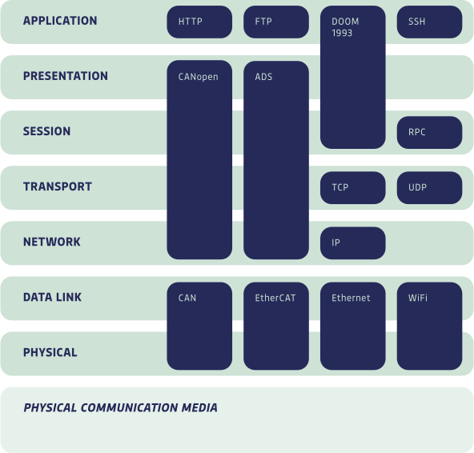

The OSI standard also motivates how to make a model like this (in §6.2.1).  In summary, each layer should be a discrete, separable item with a coherent function. Their interfaces should be succinct and only connect with adjacent layers. Fewer layers eases explanation and implementation and the choice of layers should be motivated by experience. This being a novel theory, experience will be the principal gain of future work, although case studies discussed later will also help. Helpfully, it offers a test to aid in determining layer boundaries. Layers should have a different level of abstraction in terms of /morphology/, /syntax/, and /semantics/.  This latter part is from Bloomfieldian linguistics, described in Leonard Bloomfield's /Language/.

But what does that actually mean?  Consider an example.

#+BEGIN_SRC C
printf("I have %u cows\n", num_cows);
#+END_SRC

Morphology is concerned with the atomic elements of meaning. In C code, this means short tokens of text, here =printf=, =(=, ="I have %u cows\n"=, =,=, =num_cows=, =)=, and =;=. None of these can be reduced and still carry meaning---=pri= and =ntf= seperately don't combine to make =printf=. But these atoms of meaning needn't be text or language. As will be discussed, they can be cables, connectors, computer hardware, or anything that carries semantic meaning.

When these tokens are combined into phrases, that's syntax. Syntax is the structure into which meaning is applied. The =printf= example is syntactically parsed by C compilers as in Figure [[fig:printf_syntax]]. The syntax tells that the postfix expression represented by the identifier =printf= has the argument list of ="I have %u cows\n"= (a string literal) and =num_cows= (an identifier). What any of this means is the domain of semantics.

#+NAME: fig:printf_syntax
#+CAPTION: The above printf example with syntax labeled according to [[https://archive.org/details/the-ansi-c-programming-language-by-brian-w.-kernighan-dennis-m.-ritchie.org][Kernighan & Ritchie C]].  The whole line is a postfix expression and the =printf= identifier is also a postfix expression and a primary expression on its own.  The tokens between parentheses are an argument expression list, and within that, the tokens between commas are at once many types of expressions that enable writing non-trivial code, but terminating as a primary expression, and then here as a string literal and an identifier.

The semantics of =printf= are the expected behavior of the function, which can be gleaned from the documentation. It will say that =printf= means to convert and write output to the console under the control of a format string, according to Kernighan and Ritchie.  It will also say that the format string is the first expression in the argument expression list and that it is of type =char*=.  So ="I have %u cows\n"= is that format string, and the documentation will state that the second expression in the argument expression list, here =num_cows= will be formatted as a string and written to the output where conversion character, here =%u= is.  The logic of how the conversion characters and string formatting work are based on the format string's own morphology, syntax, and semantics, the study of which is left as an exercise to the reader.

So to make a layered abstraction model like the OSI, first look for contrasts in morphology; are there fundamentally different atomic elements to components?  A mechanical system's atomic elements will be geometric bodies made from materials, whereas a power electronic system will be made from components that have a certain response to a voltage or current.  Second, how do the components syntactically relate to each other?  Mechanical components have reaction forces when in contact with other components, but electrical components make a network of components.  Lastly, what is the semantic meaning of their structure?  Mechanical components produce flexural rigidity or strength or convert one type of energy to another.  Electrical systems process, filter, or amplify electrical signals.  If functionality or tools vary greatly in these three aspects, it's quite likely that they could be seperated into abstraction layers, at least according to the OSI standard.

** DONE Diving into a CAD library with call tree analysis, Part 2 :computer:occt:
CLOSED: [2024-07-10 Wed 18:21]
:PROPERTIES:
:EXPORT_FILE_NAME: occt-call-tree-analysis-2
:EXPORT_HUGO_CUSTOM_FRONT_MATTER: :thumbnail /ox-hugo/callgrind.out.11216.svg
:END:
Previously, I showed how you can study which functions call what in a library by using gdb catchpoints to observe a running process' call stack every time a syscall is made in the application.  That was useful to understand the parts of the program related to external libraries, graphics, multi-threading, and compiler optimization, but it didn't provide any insight into the mathematical and algorithmic core of the library which generally doesn't do any syscalls.  Here I'll be showing how you can do this with the tool callgrind.

[[https://valgrind.org/docs/manual/cl-manual.html][Callgrind]] is a utility that comes with the Valgrind software instrumentation framework that tracks not only the function call graph, but also how often the functions are called and what portion of a program's run time is in a particular function.  This is very similar analysis to what I did with gdb, but thanks to Valgrind's magic, it's able to capture the mathematical internals, though it doesn't capture much of the system-level goings on and it doesn't yield any insights into what arguments functions are called with, which the previous method did.

To use it, I executed the =DRAWEXE= executable as so.

#+BEGIN_SRC bash
. env.sh d
valgrind --tool=callgrind DRAWEXE
#+END_SRC

I then ran the same experiment as before, having it render out a drill bit, moving the camera a little, and then closing out the program.  This was considerably slower than with gdb.  The render took something like 30 minutes and after a certain point, I almost stopped the experiment thinking it was hanging until something was printed to the console, showing that it was just very slow.

That produced a file =callgrind.out.11216=, where 11216 was the process ID of =DRAWEXE=.  It was 12 MB of data, less than what was generated by the gdb test with more information provided per function, probably because of high redundancy in the gdb method's archive.  To parse the data, there's a helpful utility [[https://github.com/jrfonseca/gprof2dot][=gprof2dot=]] that parses output from many profiling tools, including callgrind.

#+BEGIN_SRC bash
./gprof2dot.py \
    /path/to/callgrind.out.11216 \
    -f callgrind \
    -o callgrind.out.11216.dot
    # more options:
    # --color-nodes-by-selftime colors functions based on how long they alone took
    # --node-thres=0.1 reduces the node filtering to paths that took >0.1% of runtime
#+END_SRC

It outputs them as a [[https://graphviz.org/pdf/dotguide.pdf][DOT]] file which can be viewed using a variety of tools.  I used [[https://salsa.debian.org/python-team/packages/xdot][XDot]].

#+CAPTION: Every function is represented as a block with caller functions drawn above and connected to its callees.  The block colors are warmer hues when more time is spent in that function or its children.  Click on the image to see the fine details.  You'll need scroll a bit to see the actual image contents.
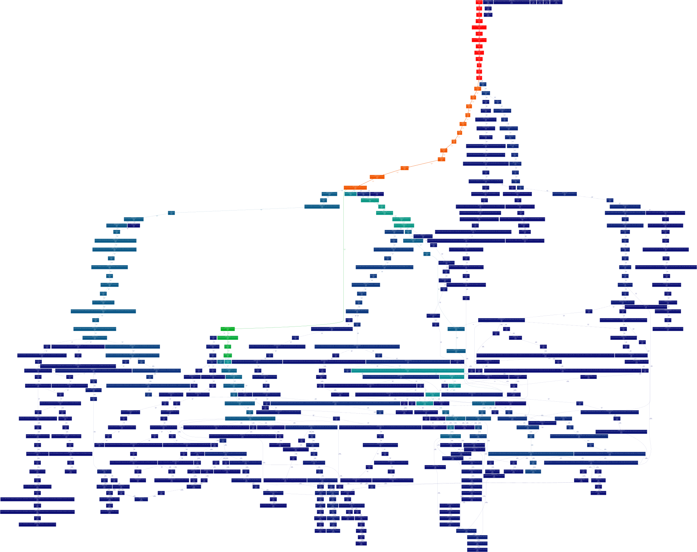

The hottest path in the figure, running from =main= at the top in red, to the bottom of the orange =Draw_Interpretor::CallBackDataFunc::Invoke= and down to =buildsweep= in green appears to be related to creating the flutes for the drill bit.  Essentially everything here is related to geometric computation.

Another insight from this image that can be gleaned from staring at this image for a long time is that polynomial evaluation takes up quite a large portion of runtime.  I looked into the source, and it uses [[https://en.wikipedia.org/wiki/Horner%27s_method][Horner's method]] to get the value of a polynomial, which turns $ax^3 + bx^2 + cx +d$ into $d + x(c + x(b + xa))$, which requires fewer multiplications, especially for large polynomials.  But as I understand it, [[https://en.wikipedia.org/wiki/De_Boor's_algorithm][De Boor's algorithm]] is somehow more performant for splines.  I wonder if that's actually true, or maybe there's a sub-optimal implementation here.

This analysis omits any functions that were on paths that took up less that 0.5% of the program's runtime, but that can be changed with =gprof2dot=.  I'll provide the [[file:assets/callgrind.out.11216][callgrind output]] if you're interested in playing with this data.

I think between callgrind and gdb, there's plenty of tooling to learn how this library works.  If I were to keep pulling on this call tree thread, I might look in to static analysis tools that get call trees from studying the source code.  I understand this command works for C++ files.

#+BEGIN_SRC bash
clang -S -emit-llvm main.cpp -o - | opt -analyze -dot-callgraph
#+END_SRC

However, OCCT has a very complex build system which would make doing this very complicated.  Not to mention that they don't seem to use LLVM-based compilers, so it's not even guaranteed to work.  But perhaps I'll explore this anyway at a later date.
** DONE Diving into a CAD library with call tree analysis     :computer:occt:
CLOSED: [2024-07-07 Sun 11:57]
:PROPERTIES:
:EXPORT_FILE_NAME: occt-call-tree-analysis
:EXPORT_HUGO_CUSTOM_FRONT_MATTER: :thumbnail /ox-hugo/occt_call_tree_gdb.png
:END:

I've for a while been interested in taking on some kind of project involving 3D CAD.  The difficulty in that is all of the futzy computational geometry, when what I'm interested in is developing compelling tools for engineers to use.  This means I need a library, and ideally an open-source one so I can easily share my work.  Luckily, I found [[https://dev.opencascade.org/][Open Cascade Technology]], or OCCT.  It's a fully-featured, battle-tested CAD library with 30+ years of development, and it's available under the [[https://www.gnu.org/licenses/old-licenses/lgpl-2.1.en.html][LGPL 2.1]] license.

Learning to use large libraries is challenging.  After several hours of trying to figure out what the built-in examples were doing, I didn't feel very close to being able to do anything.  In particular, I just didn't know where you were supposed to start with the library.  How do you make CAD with it?

In trying to understand what the examples were doing, I found myself tracing the execution of a functions up and down the project.  It was very tedious and I wanted to get a big picture faster.  I realized that if I could sample the current execution stack at some frequency across a usage session and plot which functions called which, that could get me more understanding faster.

I tried to see if this was possible, and I learned about [[https://sourceware.org/gdb/current/onlinedocs/gdb.html/Set-Catchpoints.html][catchpoints]] in GDB.  They are breakpoints which stop program execution every time some event occurs, here a system call.  This was be my sampling method.  I could save the execution stacks to a file, parse them, and then plot them.

The experiment I ran was to run the =DRAWEXE= example, render a drill bit, rotate the camera around a bit, and then close the application.  To set up, I launched =gdb= as so.

#+BEGIN_SRC 
# before this, I made a debug build
$ . env.sh d # this sets up the OCCT environment to run debug builds
$ gdb DRAWEXE
(gdb) set logging redirect on  # don't write output to the terminal
(gdb) set logging file occt_syscall.txt  # write it to a file
(gdb) set logging enabled on  # and commit these changes
(gdb) catch syscall  # break execution on every syscall
(gdb) commands  # run these commands when it stops
backtrace  # record the execution stack
continue 100  # continue execution and only stop again after 100 syscalls
#        ^ this for performance, it's uselessly slow without
end
(gdb) run  # start the experiment
#+END_SRC

This produced a 3.7 MB data file.  The stack traces generally looked like this.

#+BEGIN_SRC 
#0  __lseek64 (fd=3, offset=0, whence=0) at ../sysdeps/unix/sysv/linux/lseek64.c:40
#1  0x00007ffff7693317 in _IO_new_file_seekoff (fp=0x5555555c9260, offset=0, dir=<optimized out>, mode=<optimized out>) at ./libio/libioP.h:1030
[...]
#13 0x00007ffff7f24cc9 in Draw_Main (argc=1, argv=0x7fffffffd2e8, fDraw_InitAppli=0x5555555551a9 <Draw_InitAppli(Draw_Interpretor&)>) at /home/fp/3rd/OCCT/src/Draw/Draw_Main.cxx:111
#14 0x000055555555520b in main (argc=1, argv=0x7fffffffd2e8) at /home/fp/3rd/OCCT/src/DRAWEXE/DRAWEXE.cxx:359
#+END_SRC

At the bottom, there is =main=, which was the entry point for the program, a chain of 14 different functions call each other with the presented arguments, and it terminates in a call to the OS's =__lseek64= function, which apparently [[https://www.man7.org/linux/man-pages/man3/lseek64.3.html][opens a file]].

This data needed to be massaged into something useful that I could plot.  I decided I would do the plotting with Mathematica since it has some nice graph plotting functions.

I did the parsing with Python.  It was built with a fairly large regular expression with named groups that I could pull the results from.  The regex was built by starting with a small number of stack trace lines to parse, adjusting the expression until it matched all of them, and then doubling the number of trace lines and repeating until all the trace lines matched the regular expression

#+BEGIN_SRC python
import re

valid_line_re = re.compile(r"^#\d+ .*$")
trace_element_re = re.compile(
    r"""
    ^
     \#(?P<Number>\d+)[ ]+
     ((?P<Address>0x[\da-f]+)[ ]in[ ])?
     ((?P<Symbol>
       (llvm::Pass\*[ ])?  # weird compiler stuff
       (\?\?|[a-zA-Z_][a-zA-Z0-9_:.~]+  # regular text symbols
       (<([^<>]|<([^<>]|<[^<>]*>)*>)*>|\([^()]*\))?)  # nested templates
       (::~?\w+)?  # methods on templates or ??
       ([ ]new|\(\)|\[\])?  # operator overloads
     )[ ]
     \((?P<Args>([^)]|\"\(\"|\([^)]*\))*)\)
     ( (at|from) (?P<Path>.*))?|\?\? \(\))
    $
    """,
    re.VERBOSE
)

for line in occ_syscall_txt.split("\n"):
    if re.fullmatch(valid_line_re, line):
        matches = re.search(trace_element_re, line)
        number = int(matches.group("Number"))
        symbol = matches.group("Symbol")
        # collect the rest and put it in a data store
# write the data to a file as a Mathematica expression
#+END_SRC

=valid_line_re= is simple enough, it just detects if a line represents actual data instead of garbage that the debugger emitted (which was quite a lot).  =trace_element_re= is more complex, largely to parse the symbol.  It had to handle nested templated symbols like =OSD_Parallel::For<BOPTools_Parallel::Functor<NCollection_DynamicArray<BOPAlgo_FaceFace> > >=, operator overloads like =NCollection_SeqNode::operator new=, some odd symbols had parenthesis, and there were odd compiler-generated symbols that started with =llvm::Pass*=.  There were a lot of odd cases to deal with, but it worked correctly for the roughly millions of lines of data that had to be parsed.

In Mathematica, I assembled a graph by drawing an edge from a caller to a callee, then put all these edges into a big list and removed the duplicates.  Then I plotted it with a layered digraph embedding since it uniquely generated output that didn't look like mush.

#+CAPTION: The high-level functions like =main= and event handlers are at the top and are colored in blues.  Much of the top-left is event handling, the right is multi-threading and graphics.  In reds toward the bottom are system libraries.  Very interesting is that the fontconfig library is at the bottom; indeed it regularly calls libc directly.
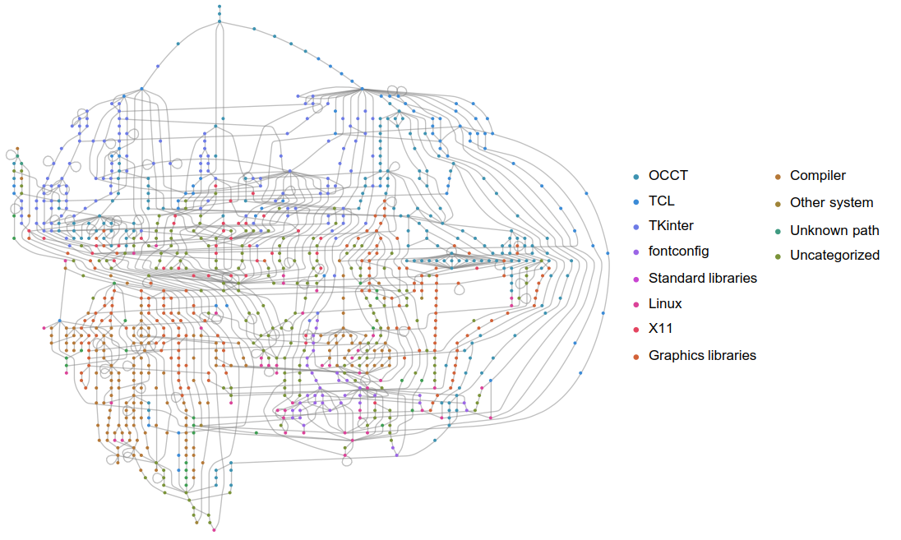

This gave really good view into how OCCT interacts with external libraries.  This could be a useful reference for ways to make the library leaner.  But it doesn't give much insight into the library's internals since it's primarily a math library, and math libraries don't do many system calls.  In the next blog post, I'll write about how [[https://valgrind.org/docs/manual/cl-manual.html][callgrind]] can be used to study a library's internals.

** A complete list of every NASA mission
I've had the understanding in my head that NASA was very active from its inception in the 50s through the early 70s with missions like Apollo, Voyager, and several Mariners, and then had some kind of lull in activity until the late 80s or mid 90s with the Space Shuttle, Hubble Space Telescope, and the mars rovers.  But I want to interrogate if there really was low activity in that range.

I'll take a look at how many missions NASA has launched when.  They provide an [[https://www.nasa.gov/a-to-z-of-nasa-missions/][index]] of every mission they've launched, and from a cursory look, it's probably the best resource to answer this question, at least in terms of number of missions.  Unfortunately, this means parsing HTML, and worse is the HTML doesn't present any semantic information.  So let's parse this BS with Python and BeautifulSoup.

#+BEGIN_SRC python
import requests

from bs4 import BeautifulSoup

MISSION_LISTING = "https://www.nasa.gov/na-to-z-of-nasa-missions/"

mission_listing_html = requests.get(MISSION_LISTING).text
mission_listing_soup = BeautifulSoup(mission_listing_html, "html.parser")

mission_urls = mission_listing_soup.body.main.find_all("p")
mission_urls = (html.a.get("href") for html in mission_urls if html.a is not None)

data = []
counter = 0
for url in mission_urls:
    if counter > 5:
        break
    counter += 1
    if "." not in url:
        print(f"URL {url} is invalid")
        continue
    try:
        html = requests.get(url).text
    except requests.exceptions.MissingSchema:
        continue
    soup = BeautifulSoup(html, "html.parser")

    data.append({
        kv.contents[1].p.string:
        kv.contents[3].stringet
        for kv in soup.find_all("div", class_="w-100")
        if kv.content is not None
    })

print(data)
#+END_SRC

#+RESULTS:
: None

** DONE Gravity Offload System :mechatronic:mechanical:electrical:control:nasa:jpl:robosimian:
CLOSED: [2020-03-16]
:PROPERTIES:
:EXPORT_FILE_NAME: gravity-offload-system
:EXPORT_HUGO_CUSTOM_FRONT_MATTER: :thumbnail /ox-hugo/ContainerTopLevel.png
:END:

In 2018 I did an internship at NASA Jet Propulsion Laboratory where I worked on a gravity-offload system to test mobility for a future rover mission to Saturn's moon Enceladus.

Prior to my arrival, there was already an offload system that consisted of a couple constant force springs hanging from a gantry on the ceiling of a shipping container. These springs connected to a robot that would drive on Enceladus-analogue dust. The gantry got pulled along the test chamber by the robot [[https://www.jpl.nasa.gov/robotics-at-jpl/robosimian][RoboSimian]], but this was problematic because friction in the gantry led to non-vertical forces on the robot, which isn't physical. My task was to add an active system to eliminate this friction.

#+CAPTION: The testbed was an inclined sandbox inside a shipping container with the gantry welded to the ceiling.
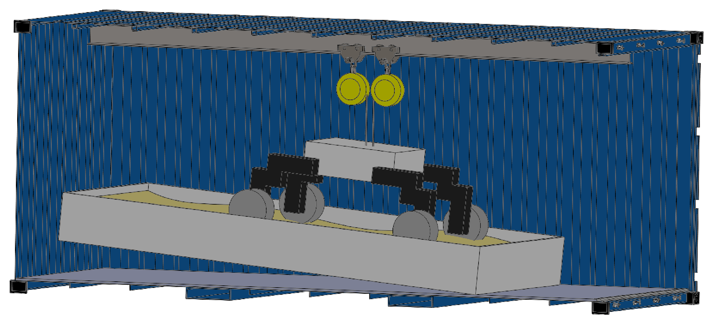

To do that, I made a robot that attached to the gantry and pulled on a chain to propell the system along the chamber. The system had a camera on it that was used to detect the position of the robot and regulate the relative position of the offload system so the robot was always in the center of the frame.

#+CAPTION: The robot bolted on to two gantry carriages and pulled itself along with a chain and sprocket.
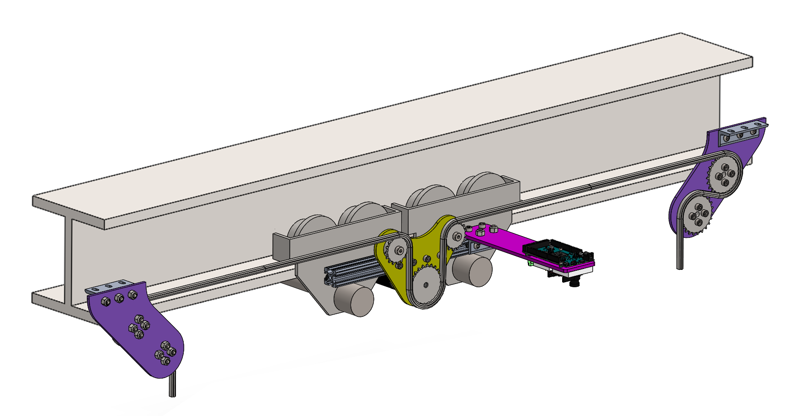

Ultimately, the system was very successful. Almost all non-vertical forces were removed by the system, and the system has been able to date for a year and a half with only minimal maintenance according to the team.

#+CAPTION: On the right is the camera that detects RoboSimians position which is fed back into the controller.  Also visible are supporting electronic and the mechanical system in the back.
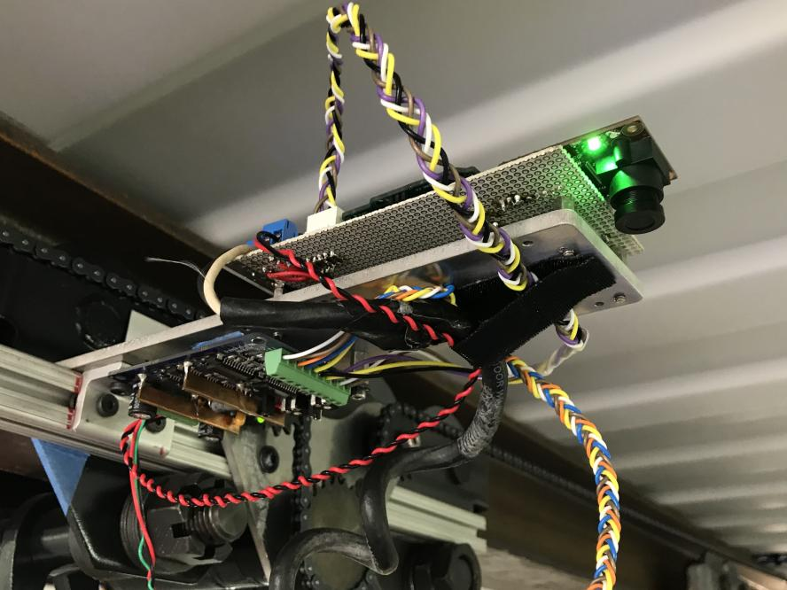

** DONE Vine Robots                     :mechanical:pneumatic:softrobot:ucsb:
CLOSED: [2020-03-16]
:PROPERTIES:
:EXPORT_FILE_NAME: vine-robots
:EXPORT_HUGO_CUSTOM_FRONT_MATTER: :thumbnail /ox-hugo/clamp.png
:END:

In 2019, I worked with the [[https://www.hawkeslab.com/][Hawkes Lab]] at UC Santa Barbara on developing a tool mount for their soft vine-like robots. I ultimately made two prototypes.

The first, seen below, is a set of three inflated plastic tubes bound together with magnets that can extend and retract. A tool attached to a plate on the end which mated to the pnuematic structure with a piece of sugical tubing that was gripped by pressure from the tubes.

#+CAPTION: With three tubes, it could orient the tool by everting the tubes relative to eachother.
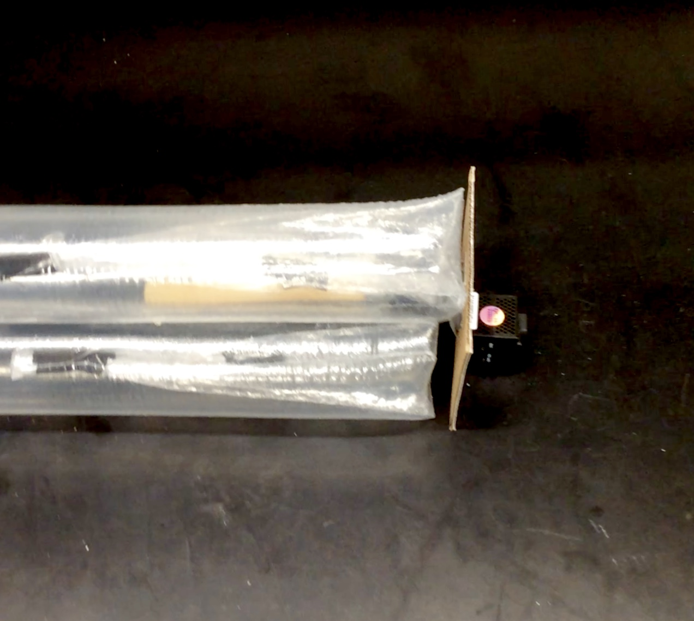

The other was a clamp where one half was inside the tube and the other half was on the outside of the tube, and the two were bonded together with magnetic rollers that allowed the robot to evert and invert while the tube rode on the end.

#+CAPTION: A tool could be attached to the outer piece and could get data and power transmission to the inside of the tube through a contactless interfaces.
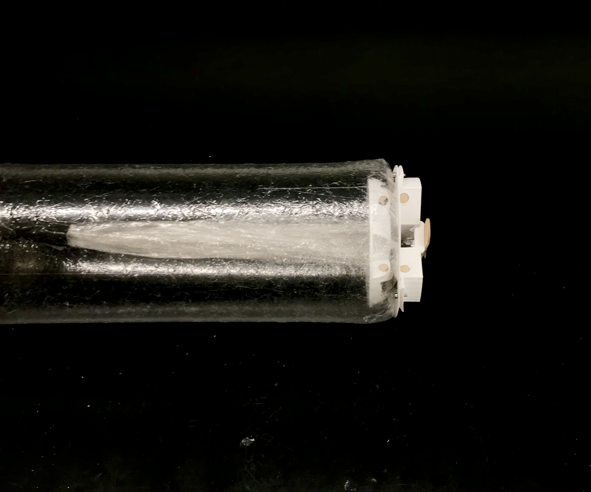

** DONE Presenting at the 2019 FIRST Tech Challenge Kickoff Workshop :design:presentation:
CLOSED: [2019-09-13]
:PROPERTIES:
:EXPORT_FILE_NAME: ftc-kickoff-2019
:EXPORT_HUGO_CUSTOM_FRONT_MATTER: :thumbnail /ox-hugo/workshop_in_progress.png
:END:

I was asked by the Los Angeles FIRST Tech Challenge organization to give a workshop on engineering design to high school students at the annual kickoff for the new season of competitive high school robotics. I gave two sessions of a 45 minute presentation on how to create innovative components for their robots to an audience of a few dozen students in each session.

#+CAPTION: Students look on to my presentation as they learn about engineering design
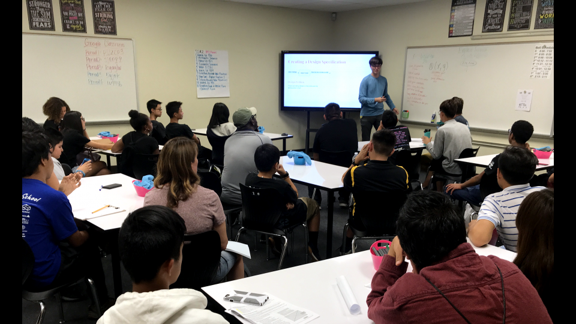

[[file:assets/making_innovative_designs.pdf][These]] are the slides for the presentation I gave.  The topic was how to design innovative systems, especially for the robots that the students will be building for their competition.  I went over how to create a design specification given a design problem (an essential step for designing any system, innovative or not), defining what and innovation even is, identifying when it's useful or not to innovate, and throughout I showed off useful tools to try to understand design.

** DONE A dolly with assisted stair climbing :mechatronic:mechanical:electrical:ucsb:
CLOSED: [2019-08-06]
:PROPERTIES:
:EXPORT_FILE_NAME: stair-climbing-dolly
:EXPORT_HUGO_CUSTOM_FRONT_MATTER: :thumbnail /ox-hugo/dolly.jpg
:END:

My bachelor thesis was to design and build a dolly that could carry a heavy, sensitive payload up and down stair with minimal force necessary from the user.  The solution I and my group came up with was to build a motorized dolly.

#+CAPTION: The payload is the black package.  The system was built on top of an off-the-shelf dolly.
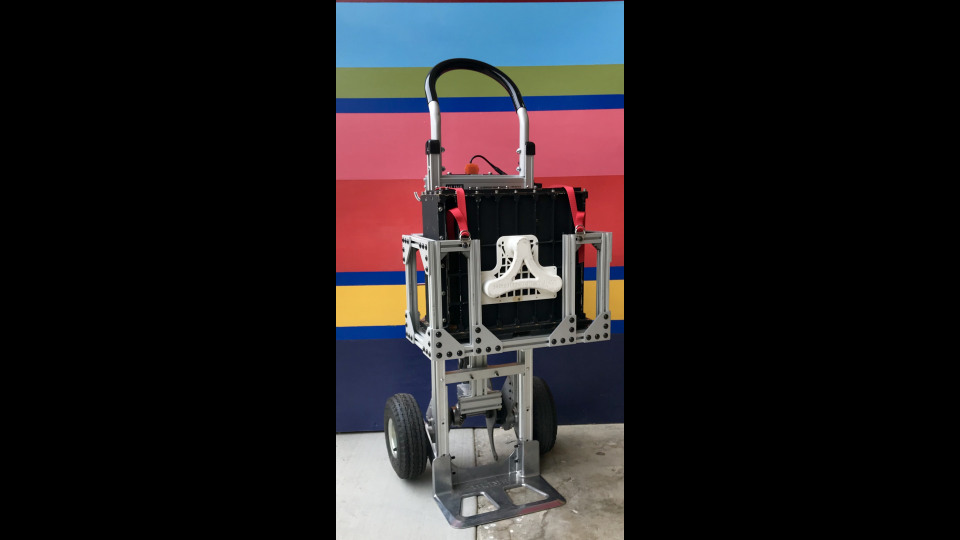

The working principle was that a flipper would push against the stairs to either pull the dolly up or resist it going down.  The control was very simple, the user commanded forward, off, or backward.

#+CAPTION: The drivetrain was a motor that turned a perpendicular shaft.  The universal joint and bearings were to take radial loads off of the motor shaft.
#+NAME: fig:dolly_drivetrain
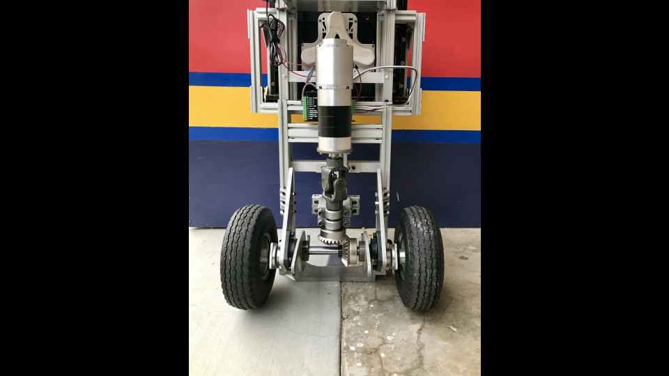

#+CAPTION: The controller was just two buttons.  The underlying computation was done by a few logic gates.
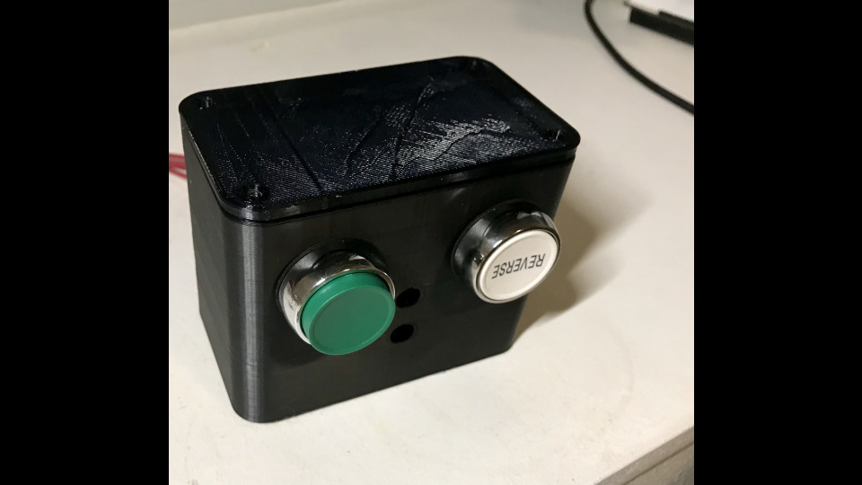

The most fun part of this project was that I got to machine most of the parts my self on a manual mill and lathe.

#+CAPTION: One of the drawings for a part that I made.  You can see it in figure [[fig:dolly_drivetrain]] holding each of the wheels on.
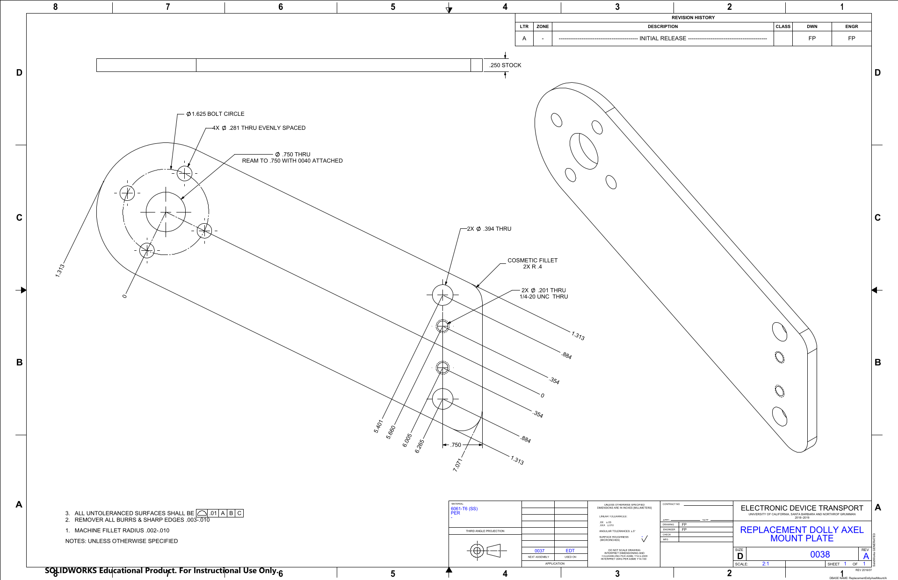

** DONE Computational Olympic rings             :programming:mathematica:fun:
CLOSED: [2019-08-06]
:PROPERTIES:
:EXPORT_FILE_NAME: computational-olympic-rings
:EXPORT_HUGO_CUSTOM_FRONT_MATTER: :thumbnail /ox-hugo/olympic_rings.png
:END:

I've heard that the Olympic Rings logo's colors are based on the colors of the world's flags. With this project, I sought to find out if you would get a similar logo if you captured the colors of the world's flags and made the Olympic Rings logo with them.  I wrote [[file:assets/olympic_rings.pdf][this article]] to determine if that's true.  Turns out, it is!

#+CAPTION: The Olympic Rings according a color palette found by studying all the world's flags

** DONE Who should star in the next Shovel Knight game? :programming:mathematica:fun:
CLOSED: [2019-08-17]
:PROPERTIES:
:EXPORT_FILE_NAME: shovel-knight-poll
:EXPORT_HUGO_CUSTOM_FRONT_MATTER: :thumbnail /ox-hugo/characterPairs.png
:END:

I did a poll in 2018 asking people what characters they'd like to see playable in a future installment of Shovel Knight. Rather than just counting the votes directly and finding a result, I created a method to find out what types of characters people would like and ultimately come up with a list of characters that the community wants that appeals to the most people while also giving the developers some freedom to pick what characters they want. You can read about it [[file:assets/SK_poll_analysis.pdf][here]].

#+CAPTION: A plot of which characters were frequently voted together.  Darker colors indicate greater frequency.
#+NAME: foo
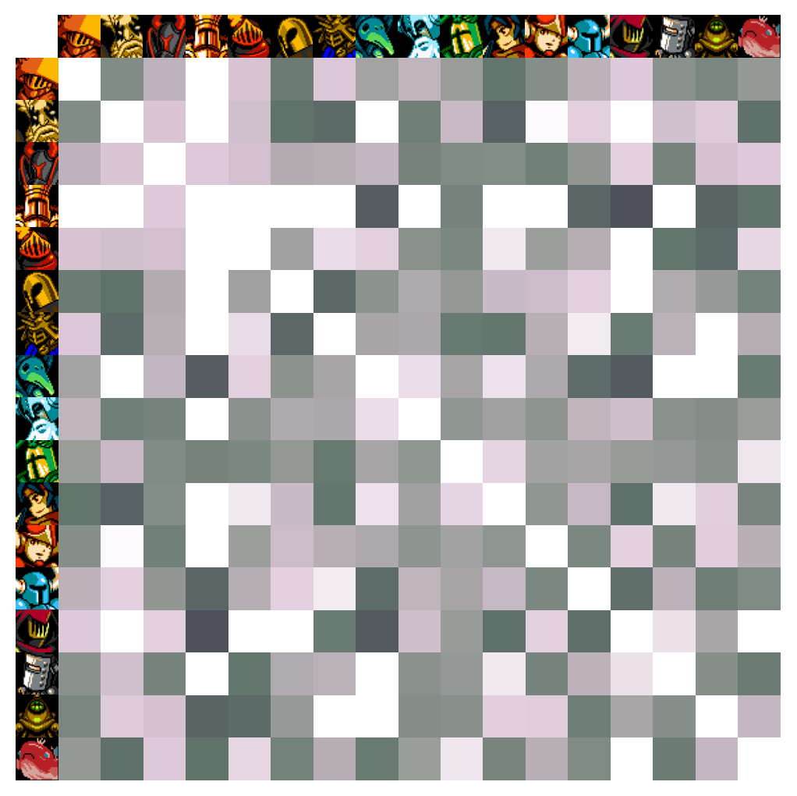

** DONE An Automatic Security Camera Lens Cleaner :mechatronic:mechanical:electrical:pneumatic:lunduniversity:
CLOSED: [2018-10-30]
:PROPERTIES:
:EXPORT_FILE_NAME: security-camera-window
:EXPORT_HUGO_CUSTOM_FRONT_MATTER: :thumbnail /ox-hugo/security_camera_lens_cleaner.jpg
:END:

During an exchange at Lund University in Sweden, I had a course project to develop a system for Axis Communications AB to clean the windows on their security cameras when rainwater or dirt gets on them. The system did this by compressing air onboard and spraying that air onto the camera window.

#+CAPTION: The system had a compressor from an electric bicycle tire pump (left), a control valve (center) to activate the quick-emission valve (right) to push a burst of air through a hose onto the camera's lens.
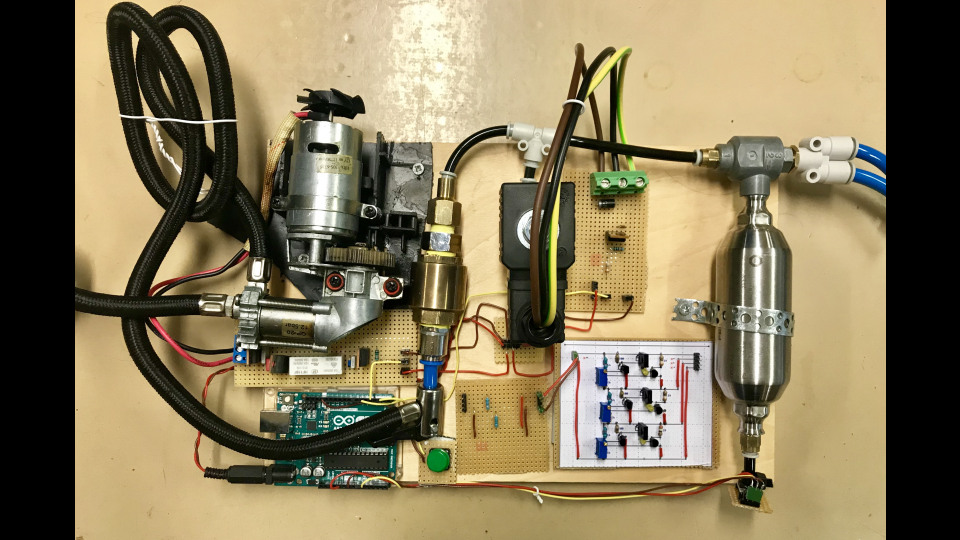

I did the mechanical design of the system, sizing and selecting the compressor, valves, and connectors in the system. I also participated in the initial ideation of the system, contributing many of the ideas that ultimately were included in the final system, as well as collecting all the ideas into a system schematic.  You can see a demonstration of its operation here.

[[yt:nzDOJuoSqGU]]

** DONE Boring 20km into Europa's surface           :mechanical:ice:nasa:jpl:
CLOSED: [2016-08-26 Wed 16:29]
:PROPERTIES:
:EXPORT_FILE_NAME: owms
:EXPORT_HUGO_CUSTOM_FRONT_MATTER: :thumbnail /ox-hugo/owms_level_wind.png
:END:
During an internship at NASA Jet Propulsion Laboratory in 2016, I designed a system to test a concept for a probe to explore inside of Jupiter's moon Europa. It uses a circular saw rotating about the vertical axis to create a borehole in ice, which on Europa would be ~20 km deep. I was an author of a paper on this system published in IEEE aerospace, available [[https://ieeexplore.ieee.org/document/7943863][here]].

#+CAPTION: This component is a level wind for the system.  It held a tether (green, 20 km worth) and spooled it out one layer at a time, each layer alternating spiraling inward and outward.  The mechanical components rotated about the threaded central pillar and the tether would go up along the red pulley as it traveled along the length of the cyan shaft.
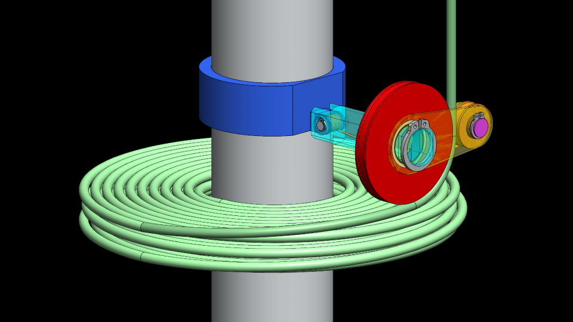

This video shows the probe as it would be applied on Europa.

[[yt:nBzBeYsdNsM?start=62][Exploring Ocean Worlds with NASA Robots]]

This video shows a test I designed for verifying that the circular saw concept for creating the borehores works (it does!).

[[yt:dgGWmtRm8hI][OWMS Saw Test]]

** DONE OPALS Wikipedia Article                      :writing:ucsb:wikipedia:
CLOSED: [2015-11-28 Sat 16:28]
:PROPERTIES:
:EXPORT_FILE_NAME: opals-wikipedia
:EXPORT_HUGO_CUSTOM_FRONT_MATTER: :thumbnail /ox-hugo/opals_under_construction.jpg
:END:

During fall quarter of my freshman year at UCSB, I wrote a Wikipedia article for a writing class on the [[https://www.jpl.nasa.gov/missions/optical-payload-for-lasercomm-science-opals][Optical PAyload for Lasercomm Science (OPALS)]] mission out of JPL/Caltech.

You can view it [[https://en.wikipedia.org/wiki/OPALS][here]].

#+CAPTION: OPALS under construction (/Image credit JPL/Caltech via Wikimedia Commons/)
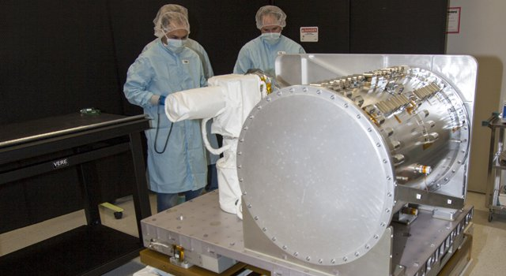

** DONE A hand for a disaster recovery robot :mechanical:robosimian:nasa:jpl:
CLOSED: [2015-10-21]
:PROPERTIES:
:EXPORT_FILE_NAME: hand-disaster-recovery-robot
:EXPORT_HUGO_CUSTOM_FRONT_MATTER: :thumbnail /ox-hugo/cam_hand_render.jpg
:END:

In summer 2014, I worked at NASA Jet Propulsion Laboratory in their Robotic Vehicles and Manipulators lab. I worked on the design for a so-called Cam Hand for the disaster recovery robot, [[https://www.jpl.nasa.gov/robotics-at-jpl/robosimian][RoboSimian]].

#+CAPTION: This design was called the Cam Hand since the hand could reach into crevices and expand to grip with a self-locking cam action.  This was inspired by the cam tools used by mountain climbers.
[[file:assets/cam_hand_render.jpg]]

Here is a video of Principal Investigator Brett Kennedy speaking about the fingers I designed.

[[yt:nZ309aM4CNM?start=2035][JPL Rescue Robots]]

Here is a video of RoboSimian at the 2015 DARPA Robotics Challenge Finals, demonstrating dextrous manipulation.

[[yt:NSFm7sxDDiU][Team Robosimian Time Lapse - Day 1]]

* Publications
# For now, this has to be done manually without org-mode...

#+BEGIN_SRC sh :exports results :results html
if [ ! -d venv ]; then python3 -m venv; fi
. venv/bin/activate
pip install --requirement requirements.txt > /dev/null
python publications.py
#+END_SRC

#+RESULTS:
#+begin_export html

    
    

    Fletcher Porter and Jari Vepsäläinen.  "A Model for Selecting Software Tools for Fluid Power Systems (In Review)", <i>The 12th JFPS International Symposium on Fluid Power</i>, 2024.
    

	<input type="checkbox" class="abstract-check" id="Porter2024abs" checked="">
<label class="bib-artifact" for="Porter2024abs">[abstract]</label>
	
	
	<input type="checkbox" class="bib-check" id="Porter2024bib" checked="">
	<label class="bib-artifact" for="Porter2024bib"> [bib]</label>
	

	    <textarea readonly="true">@InProceedings{Porter2024,
  author    = {Fletcher Porter and Jari Vepsäläinen},
  booktitle = {The 12th {JFPS} International Symposium on Fluid Power},
  title     = {A Model for Selecting Software Tools for Fluid Power Systems (In Review)},
  year      = {2024},
  abstract  = {Fluid power systems can be enormously complex. The chiefest complexity is in their control components due to the deep knowledge required for effective development, the need to interface with myriad heterogeneous components, and the opacity of its operation. In the IT sector, a tech stack is a known discretization of function within a system, typically used to categorize what software tools do. This enables disparate parts of a system to be developed separately. Inspired by IT tech stacks, this paper presents a model, the mechatronic tech stack, to mitigate this complexity by siloing control system behavior into discrete functions and classifying what tools can be used to meet them. The model is demonstrated on three case studies of diverse application. The theory is promising, but there are challenges in defining the most useful abstractions and interfaces.},
}</textarea>
        

	<blockquote class="abstract-src">
Fluid power systems can be enormously complex. The chiefest complexity is in their control components due to the deep knowledge required for effective development, the need to interface with myriad heterogeneous components, and the opacity of its operation. In the IT sector, a tech stack is a known discretization of function within a system, typically used to categorize what software tools do. This enables disparate parts of a system to be developed separately. Inspired by IT tech stacks, this paper presents a model, the mechatronic tech stack, to mitigate this complexity by siloing control system behavior into discrete functions and classifying what tools can be used to meet them. The model is demonstrated on three case studies of diverse application. The theory is promising, but there are challenges in defining the most useful abstractions and interfaces.
</blockquote>
    

    Fletcher Porter.  "A Model of Selecting Software Tools for Mechatronic Systems", mathesis, Aalto University, 2024.
    

	<input type="checkbox" class="abstract-check" id="Porter2024aabs" checked="">
<label class="bib-artifact" for="Porter2024aabs">[abstract]</label>
	<a class="bib-artifact" href=":assets/ms-fletcher-porter.pdf:PDF">[pdf]</a>
	
	<input type="checkbox" class="bib-check" id="Porter2024abib" checked="">
	<label class="bib-artifact" for="Porter2024abib"> [bib]</label>
	

	    <textarea readonly="true">@MastersThesis{Porter2024a,
  author   = {Fletcher Porter},
  school   = {Aalto University},
  title    = {A Model of Selecting Software Tools for Mechatronic Systems},
  year     = {2024},
  month    = jul,
  type     = {mathesis},
  abstract = {Mechatronic systems can be enormously complex. The chiefest complexity is in their control components due to the deep knowledge required for effective development, the need to interface with myriad heterogeneous components, and the opacity of its operation. In the IT sector, a tech stack is a known discretization of function within a system, typically used to categorize what software tools do. This enables disparate parts of a system to be developed separately. Inspired by IT tech stacks, this paper presents a model, the mechatronic tech stack, to mitigate this complexity by siloing control system behavior into discrete functions and classifying what tools can be used to meet them. The model is demonstrated on three case studies of diverse application. The theory is promising, but there are challenges in defining the most useful abstractions and interfaces.},
  file     = {:assets/ms-fletcher-porter.pdf:PDF},
}</textarea>
        

	<blockquote class="abstract-src">
Mechatronic systems can be enormously complex. The chiefest complexity is in their control components due to the deep knowledge required for effective development, the need to interface with myriad heterogeneous components, and the opacity of its operation. In the IT sector, a tech stack is a known discretization of function within a system, typically used to categorize what software tools do. This enables disparate parts of a system to be developed separately. Inspired by IT tech stacks, this paper presents a model, the mechatronic tech stack, to mitigate this complexity by siloing control system behavior into discrete functions and classifying what tools can be used to meet them. The model is demonstrated on three case studies of diverse application. The theory is promising, but there are challenges in defining the most useful abstractions and interfaces.
</blockquote>
    

    Brian H. Wilcox, Jason A. Carlton, Justin M. Jenkins, and Fletcher A. Porter.  "A deep subsurface ice probe for Europa", <i>IEEE Aerospace Conference</i>, 2017.
    

	<input type="checkbox" class="abstract-check" id="Wilcox2017abs" checked="">
<label class="bib-artifact" for="Wilcox2017abs">[abstract]</label>
	
	<a class="bib-artifact" href="https://doi.org/10.1109/AERO.2017.7943863">[doi]</a>
	<input type="checkbox" class="bib-check" id="Wilcox2017bib" checked="">
	<label class="bib-artifact" for="Wilcox2017bib"> [bib]</label>
	

	    <textarea readonly="true">@INPROCEEDINGS{Wilcox2017,
  author={Wilcox, Brian H. and Carlton, Jason A. and Jenkins, Justin M. and Porter, Fletcher A.},
  booktitle={{IEEE} Aerospace Conference}, 
  title={A deep subsurface ice probe for Europa}, 
  year={2017},
  volume={},
  number={},
  pages={1-13},
  keywords={Probes;Ice;Electron tubes;Oceans;Heating systems;Blades;Wires},
  doi={10.1109/AERO.2017.7943863},
  abstract={This paper describes work on a concept for a probe that would be capable of km-scale deep subsurface ice penetration on Europa or other Ocean World. Penetrating deep into or through the ice cap over the liquid ocean is the best way to establish if life has evolved there. A central thesis of this work is that we must start by addressing the Planetary Protection constraints, and not to try to add them on at the end. Specifically, all hardware in the probe would be designed to survive heat sterilization at 500C for extended periods, as required to meet the COSPAR 1-in-10,000 probability per mission of biological contamination of the ocean. The baseline concept features a heat source containing plutonium-238 encased within a stainless Dewar so that the heat is not lost by conduction into the ice. A circular saw blade sticks out through a slot in a hemispherical turret dome at the bottom of the Dewar such that the blade cuts the ice as it spins. The turret also rotates slowly to cause the saw blade to make a hemispherical cut in the ice. The ice chips would be thrown up through the slit into the turret and would be melted by the heat source. The meltwater drains into sumps on either side of the sawblade, from which the meltwater would be pumped out to the rear of the probe.
The main body of the probe contains a spool of aluminum tubing that would be dispensed from within the probe all the way back to the lander. This tubing is nominally 1-3 mm in outside dimension with integral insulated electrical wires around the center hole. This tube would pneumatically transport small (mm-scale) single-use canisters containing meltwater samples from the probe to the surface for analysis. Surface analysis allows use of instruments that can be neither miniaturized nor sterilized sufficiently to go down-hole. Dry inert gas would be used to push the canister down from the lander and back up. The dry gas would be re-compressed and re-used. During a portion of the cruise to the outer solar system, the heat source would heat the entire probe, including the coiled tubing inside as well as all the canisters and inert gas, to 500C to destroy any lingering organisms and to decompose any complex organic molecules.
The paper describes analysis, design, and preliminary testing, as well as plans for building a prototype and testing it in an &quot;ice treadmill&quot; where a plug of ice is created inside a vertical LN2 cold jacket, pushed up by water pumped below so that the ice plug rises at the same rate that the probe penetrates the ice.}
}</textarea>
        

	<blockquote class="abstract-src">
This paper describes work on a concept for a probe that would be capable of km-scale deep subsurface ice penetration on Europa or other Ocean World. Penetrating deep into or through the ice cap over the liquid ocean is the best way to establish if life has evolved there. A central thesis of this work is that we must start by addressing the Planetary Protection constraints, and not to try to add them on at the end. Specifically, all hardware in the probe would be designed to survive heat sterilization at 500C for extended periods, as required to meet the COSPAR 1-in-10,000 probability per mission of biological contamination of the ocean. The baseline concept features a heat source containing plutonium-238 encased within a stainless Dewar so that the heat is not lost by conduction into the ice. A circular saw blade sticks out through a slot in a hemispherical turret dome at the bottom of the Dewar such that the blade cuts the ice as it spins. The turret also rotates slowly to cause the saw blade to make a hemispherical cut in the ice. The ice chips would be thrown up through the slit into the turret and would be melted by the heat source. The meltwater drains into sumps on either side of the sawblade, from which the meltwater would be pumped out to the rear of the probe.

The main body of the probe contains a spool of aluminum tubing that would be dispensed from within the probe all the way back to the lander. This tubing is nominally 1-3 mm in outside dimension with integral insulated electrical wires around the center hole. This tube would pneumatically transport small (mm-scale) single-use canisters containing meltwater samples from the probe to the surface for analysis. Surface analysis allows use of instruments that can be neither miniaturized nor sterilized sufficiently to go down-hole. Dry inert gas would be used to push the canister down from the lander and back up. The dry gas would be re-compressed and re-used. During a portion of the cruise to the outer solar system, the heat source would heat the entire probe, including the coiled tubing inside as well as all the canisters and inert gas, to 500C to destroy any lingering organisms and to decompose any complex organic molecules.

The paper describes analysis, design, and preliminary testing, as well as plans for building a prototype and testing it in an &quot;ice treadmill&quot; where a plug of ice is created inside a vertical LN2 cold jacket, pushed up by water pumped below so that the ice plug rises at the same rate that the probe penetrates the ice.
</blockquote>
    

#+end_export

